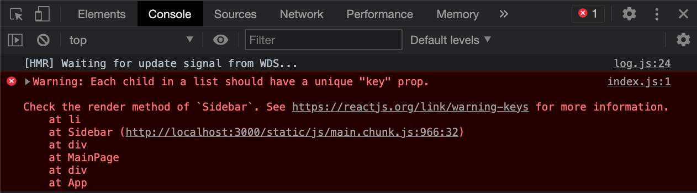

# React Props

## Learning Objectives

- Pass data to a React component with props
- Learn different methods for passing props to a React component
- Understand how props alllow us to make components dynamic

---

## Introducing Props

Props are a tool for passing information from a parent component to a child component. They allows us to create different versions of the component every time we render it out.

---

### Refresh on Functional Concepts

To understand **React props** it will help to refresh our understanding on some important concepts of how functions work. 
These concepts may seem basic to some at this point but they are important for today's lesson and we will be building on them. Follow along and play around with these concepts in a code editor.

Take our function `getGreeting` which takes in a person's name as a parameter and returns a customized greeting for that person.

```js
function getGreeting(personName) {
  return `Hello ${personName}.`;
}
```

Every time we call the `getGreeting` function and pass in a new name we get a different greeting.

```js
console.log(getGreeting('Greta'));
console.log(getGreeting('Hubert'));
console.log(getGreeting('Zoey'));
```

A function takes in inputs (arguments or parameters) and spits out an output (the return value). This is the essential concept that we will be building on.

We can pass more inputs (parameters) to our function if we want.

```js
function getGreeting(personName, dayOfWeek) {
  return `Hello ${personName}. Today is ${dayOfWeek}.`;
}

console.log(getGreeting('Greta', 'Tuesday'));
console.log(getGreeting('Greta', 'Wednesday'));
```

We can pass different arguments to our function call and get a different, customized output each time.

Most of the time we will store those inputs in a variable and pass variables to our function call like so.

```js
function getGreeting(personName, dayOfWeek) {
  return `Hello ${personName}. Today is ${dayOfWeek}.`;
}

const name = 'Hubert';
const day = 'Thursday';

console.log(getGreeting(name, day));
```

We are still able to get our greeting even when the inputs come from variables.

Take some time to create your own functions that takes their own inputs (parameters). For example, you could create a function `createOrder` that takes as parameters information about a person's order at a restaurant and returns a string describing their order. You could create a function that takes in information about a person and returns a string describing that person. You should be very comfortable with these concepts before moving on.

React components are essentially functions that take in inputs (**props**) and return an output (**JSX**, the actual markup for the component).

---

## Code Along: Introducing Props

To explore the concept of **React props** let's return to the Recipe App that we started in the "Intro to React" lesson. We'll start with the `Person` component that we created in `./src/components/Person.js`. Let's see how we can set up our `Person` component to create a different person each time.

In the `App.js` file import the `Person` component again. And let's render the `Person` component inside of the `App` component. For now, comment out the other components in our `App` component.

```js
import Header from './components/Header';
import HomePage from './pages/HomePage';
import MainPage from './pages/MainPage';
import Person from './components/Person';
import './App.css';

function App() {
  return (
    <div className="App">
      <Person />
      {/* <Header /> */}
      {/* <HomePage /> */}
      {/* <MainPage /> */}
    </div>
  );
}

export default App;
```

Just as we can pass information to a function with arguments when we call it, we can pass information to a component with **props** when we call or render that component. Pass a personName **prop** to the `Person` component like so.

```js
// import Header from './components/Header';
// import HomePage from './pages/HomePage';
// import MainPage from './pages/MainPage';
import Person from './components/Person';
import './App.css';

function App() {
  return (
    <div className="App">
      <Person personName="Greta"/>
      {/* <Header /> */}
      {/* <HomePage /> */}
      {/* <MainPage /> */}
    </div>
  );
}

export default App;
```

Inside of `Person.js` where we define the `Person` component we can set up our component to recieve **props** by passing a parameter to the `Person` function like so.

```js
function Person(props) {
  return (
    <div>
      <h2>Name: Flynn</h2>
      <p>Favorite Color: Blue</p>
    </div>
  );
}

export default Person;
```

At the top of our function before the return statement, let's log out **props**.

```js
function Person(props) {
  console.log('props inside Person =>', props);

  return (
    <div>
      <h2>Name: Flynn</h2>
      <p>Favorite Color: Blue</p>
    </div>
  );
}

export default Person;
```

Save the file and take a look at your browser's console. What do you see?


When we log out **props**, we see that props is an **object** with a personName property set to "Greta" or whatever value we passed in.

Go back to the `App.js` file and change the personName prop to something else. Pass in a different string instead of "Greta". Try passing in a number or a boolean. What do you see in the console?

---

### Passing Multiple Props

Pass a second **prop** to the `Person` component. Let's pass a `favColor` props and give it any value you want.

```js
// import Header from './components/Header';
// import HomePage from './pages/HomePage';
// import MainPage from './pages/MainPage';
import Person from './components/Person';
import './App.css';

function App() {
  return (
    <div className="App">
      <Person personName="Greta" favColor="purple" />
      {/* <Header /> */}
      {/* <HomePage /> */}
      {/* <MainPage /> */}
    </div>
  );
}

export default App;
```
If you are still logging out **props** in your `Person`, take a look at what is being logged out in the browser's console. 

We are still logging out an **object**. **Props** inside the `Person` component is an **object** with a `personName` property and a `favColor` property.

We can pass any **prop** we want to the `Person` component and it will show up as a property in the props **object**. Try passing more props to the `Person` component and see what gets logged out.

---

### Using a Component's Props

At this point we are passing **props** to a component. Now let's see how we can use those **props** to render something to the page.

Since `props` is just a JavaScript object we can reference the properties in that object using dot notation. Let's insert the `personName` **prop** and the `favColor` **prop** into our **JSX**.

```js
function Person(props) {
  console.log('props inside Person =>', props);

  return (
    <div>
      <h2>Name: {props.personName}</h2>
      <p>Favorite Color: {props.favColor}</p>
    </div>
  );
}

export default Person;
```

In order to insert JavaScript into **JSX** we use curly braces, `{}`. Inside a pair of curly braces we can insert any JavaScript we want. In this case, we are just inserting two properties from our **props** object that is coming in as the **props** parameter to the function.

Take a look at the browser. We are rendering the `Person` component to the page with the values we passed to the component as **props**.

---

### Rendering Different Instances of a Component

At this point we are set up to create many different people using our `Person` component. Let's render out a few more `Person` components passing different props each time.

```js
// import Header from './components/Header';
// import HomePage from './pages/HomePage';
// import MainPage from './pages/MainPage';
import Person from './components/Person';
import './App.css';

function App() {
  return (
    <div className="App">
      <Person personName="Greta" favColor="purple" />
      <Person personName="Hubert" favColor="lime green" />
      <Person personName="Roberta" favColor="orange" />
      {/* <Header /> */}
      {/* <HomePage /> */}
      {/* <MainPage /> */}
    </div>
  );
}

export default App;
```

Take a look at the output in the browser. We now have three different `Person` components rendered to the page. Each one has a different output based on the **props** that we've passed to it when rendering that `Person` component in the `App` component.

## Code Along: Adding Props to the Recipe App

In our `App` component in `./src/App.js`, let's remove our `Person` components and bring back the `Header`, and `MainPage` components. We'll leave the `HomePage` component commented out for now so we are just viewing the main page. You can also comment out the `Person` components if you want to save them for later.

```js
import Header from './components/Header';
// import HomePage from './pages/HomePage';
import MainPage from './pages/MainPage';
import './App.css';

function App() {
  return (
    <div className="App">
      <Header />
      {/* <HomePage /> */}
      <MainPage />
    </div>
  );
}

export default App;
```
In the browser, we should now see our main page showing our categories on the side and recipes towards the bottom.

The majority of our work for the rest of the lesson will be in the `MainPage` component. Our goal is to store our data for cateogies and recipes at the top level in our `MainPage` component and pass that data to the child components as **props** to be rendered to the page.

### Defining the Category and Recipe Data

Create a new file called `categoryData.js` in the `src` directory.

```bash
touch ./src/categoryData.js
```
<details>
  <summary>Copy and paste this code into the `catagoryData.js` file.</summary>

  ```js
const categoryData = [
  {
    _id: '0',
    categoryName: 'Breakfast',
    categoryDescription: 'Lorem ipsum dolor sit amet, consectetur adipisicing elit. Quis, eligendi. Repellendus voluptates vel, consequatur sequi dolorem repellat blanditiis aut optio impedit quidem ut officiis laudantium vitae dicta aspernatur ullam quis?',
    categoryImg: 'https://images.unsplash.com/photo-1533089860892-a7c6f0a88666',
    recipes: [
      {
        _id: '0',
        recipeName: 'Breakfast Potatoes',
        recipeDescription: 'Lorem ipsum dolor sit amet, consectetur adipisicing elit. Repellendus facere ab cumque autem ea deserunt est sit quasi in nihil quibusdam, quos, animi laborum voluptate doloribus ullam blanditiis ipsam ut!`'
      },
      {
        _id: '1',
        recipeName: 'French Toast',
        recipeDescription: 'Lorem ipsum dolor sit amet, consectetur adipisicing elit. Repellendus facere ab cumque autem ea deserunt est sit quasi in nihil quibusdam, quos, animi laborum voluptate doloribus ullam blanditiis ipsam ut!`'
      },
      {
        _id: '2',
        recipeName: 'Huevos Rancheros',
        recipeDescription: 'Lorem ipsum dolor sit amet, consectetur adipisicing elit. Repellendus facere ab cumque autem ea deserunt est sit quasi in nihil quibusdam, quos, animi laborum voluptate doloribus ullam blanditiis ipsam ut!`'
      },
    ]
  },
  {
    _id: '1',
    categoryName: 'Soups',
    categoryDescription: 'Lorem ipsum dolor sit amet, consectetur adipisicing elit. Quis, eligendi. Repellendus voluptates vel, consequatur sequi dolorem repellat blanditiis aut optio impedit quidem ut officiis laudantium vitae dicta aspernatur ullam quis?',
    categoryImg: 'https://images.unsplash.com/photo-1588566565463-180a5b2090d2',
    recipes: [
      {
        _id: '0',
        recipeName: 'Tomato Bisque',
        recipeDescription: 'Lorem ipsum dolor sit amet, consectetur adipisicing elit. Repellendus facere ab cumque autem ea deserunt est sit quasi in nihil quibusdam, quos, animi laborum voluptate doloribus ullam blanditiis ipsam ut!`'
      },
      {
        _id: '1',
        recipeName: 'Split Pea Soup',
        recipeDescription: 'Lorem ipsum dolor sit amet, consectetur adipisicing elit. Repellendus facere ab cumque autem ea deserunt est sit quasi in nihil quibusdam, quos, animi laborum voluptate doloribus ullam blanditiis ipsam ut!`'
      },
    ]
  },
  {
    _id: '2',
    categoryName: 'Pasta Dishes',
    categoryDescription: 'Lorem ipsum dolor sit amet, consectetur adipisicing elit. Quis, eligendi. Repellendus voluptates vel, consequatur sequi dolorem repellat blanditiis aut optio impedit quidem ut officiis laudantium vitae dicta aspernatur ullam quis?',
    categoryImg: 'https://images.unsplash.com/photo-1603729362753-f8162ac6c3df',
    recipes: [
      {
        _id: '0',
        recipeName: 'Stroganoff',
        recipeDescription: 'Lorem ipsum dolor sit amet, consectetur adipisicing elit. Repellendus facere ab cumque autem ea deserunt est sit quasi in nihil quibusdam, quos, animi laborum voluptate doloribus ullam blanditiis ipsam ut!`'
      }
    ]
  }
];

export default categoryData;
  ```
</details>

Take a moment to familiarize yourself with the data here. We have an array of category objects. Each object contains the name, and description for that category, and an array of recipes for that category. Our job is to take this data and to feed it as **props** to our components and have that information display on the page, just like we were able to do with our `Person` component from before.

Eventually this data will be coming from a database and we'll make a network request to get this data from our API. For now we'll work with this as a placeholder. Note that each category object is already "populated" with the recipe data.

### Passing Data as Props

Import `categoryData` into `MainPage.js` and log out `categoryData`. You should see your data logged in the console. After that, feel free to comment out your log message.

```js
import categoryData from '../categoryData';

console.log('categoryData =>', categoryData);
...
```

We'll start with our `Sidebar` component. Our eventual goal is to feed the `categoryData` to our `Sidebar` component and render out a list of category names, one for each category object in `categoryData`.

In `MainPage.js`, feed a `categories` **prop** to the `Sidebar` component passing in the `categoryData` variable.

```js
...

function MainPage() {
  return (
    <div className="main-page">
      <Sidebar categories={categoryData} />
      <main className="category-info">
        <CategoryDetail />
        <RecipesList />
      </main>
    </div>
  );
}

...
```

Here, `categoryData` is just a variable that holds our array of data. We are feeding that array of data as a prop that we've decided to call `categories`. It is important to note that `categories` is the name of the prop being passed. Inside of the `Sidebar` component we have access to `props.categories` not `props.categoryData`.

### Creating a List of Components

Let's make our way back to `Sidebar.js`. In the `Sidebar` component. We'll first pass props as a parameter to the `Sidebar` component and then log out **props**.

```js
function Sidebar(props) {
  console.log('props in Sidebar =>', props);

  return (
    <aside className="sidebar">
      <ul>
        <li className="sidebar-card">Breakfast</li>
        <li className="sidebar-card">Soups</li>
        <li className="sidebar-card">Pasta Dishes</li>
      </ul>
    </aside>
  );
}
...
```

Check the console and you should see your array of category data.

### Introducing the "map" Method

In the **JSX** for our `Sidebar` component we are hard coding that list of category names, "Breakfast", "Soups", and "Pasta Dishes". What we want to do is loop through our array of `categoryData` and render out one `<li>` for each one of the categories, just showing the category name.

We essentially want to take our array of category objects and convert it into an array of `<li>`s. JavaScript gives us a handy method for converting one array into another array: [JavaScript's map method](https://developer.mozilla.org/en-US/docs/Web/JavaScript/Reference/Global_Objects/Array/map). Take some time to read the documentation and see if you can figure out how it works.

Here is a small example that we can try in our `Sidebar.js` file just to get the concept. We can code this out above our `Sidebar` component function. Say we have an array of people objects.

```js
const people = [
  {
    firstName: 'Wendy',
    lastName: 'Franklin',
    favColor: 'blue',
    age: 34
  },
  {
    firstName: 'Derek',
    lastName: 'Samson',
    favColor: 'green',
    age: 23
  },
  {
    firstName: 'Sarah',
    lastName: 'Olson',
    favColor: 'marigold',
    age: 45
  }
];
```

Our goal is to create a brand new array of just the first names of all the people, using our original array of people. That new array would look like this.

```js
const firstNames = [
  'Wendy',
  'Derek',
  'Sarah'
];
```

Just as every array has access to a **push** or **pop** method to add and remove items to the array, every array also has access to a **map** method that will allow us to create a brand new array out of our existing array. It would look something like this.

```js
const teamRoster = people.map((person) => {
  return person.firstName;
});
```
We call the **map method** on the people array. The map method takes as an argument a callback function that will be called each time we loop through the array. Each time we loop through the array we have access to the current item that we are looping over, in this case the `person` object. `person` is a parameter that we can name whatever we want. We're saying each time we loop over the `people` array, for each `person`, return just the first name of the person with `return person.firstName`. The value that we return each time we loop through gets added to a brand new array that we call `teamRoster`.

Log out `teamRoster`.
```js
const teamRoster = people.map((person) => {
  return person.firstName;
});

console.log(teamRoster);
```
We should see our array of just first names.

This will no doubt be confusing the first time and many times after that. Take at least a few minutes to play around with the **map method** some more. Loop through an array of car objects, animal objects, grocery item objects, etc...

### Using the map Method to Get an Array of JSX

Go ahead and delete your previous code playing with the **map method** or comment it out.

We'll move back to working with the `Sidebar` component in `Sidebar.js`.

In the **JSX** for our `Sidebar` component we are hard coding that list of category names, "Breakfast", "Soups", and "Pasta Dishes". Our goal is to loop through the array of category data and render out one `<li>` for each category object, showing just the category name. We essiantially want to take our array of categories and get an array of `<li>`s; perfect for JavaScript's **map method**.

If we quickly look back `MainPage.js` we can see that the name of the **prop** we are passing to the `Sidebar` component is `categories`. This is the name we'll use to access the data inside of the `Sidebar` component.

Map over `props.categories` and create an array of `<li>`s with the `categoryName` inside the `<li>`. We only have access to props in the `Sidebar` function so we'll do our looping (mapping) in there.

```js
function Sidebar(props) {
  const categoriesList = props.categories.map((category) => {
    return (
      <li className="sidebar-card">
        {category.categoryName}
      </li>
    );
  });

  return (
    <aside className="sidebar">
      <ul>
        {categoriesList}
      </ul>
    </aside>
  );
}

export default Sidebar;
```

We are mapping through our array of category data (`props.categories`) and creating an array of `<li>`s. This array of `<li>`s gets stored in a variable we call `categoriesList`. We can then insert this `categoriesList` variable into the `<ul>` of our **JSX**.

Take a look at the browser. We should see our list of categories in the sidebar just as before! Now here comes the fun part. Go ahead and change one of the category names in `categoryData.js` and watch the content change on the page! Instead of hard coding the content we are dynamically populating from `categoryData.js`.

If you open up the developer console you'll also see this warning.



Note this is a warning and not an error, even though it's in red. Our app is running just find in the browser and nothing breaks.

The warning is telling us that whenever we dynamically create a list of **JSX** items, each item should have a unique **key prop**. This allows React to keep track of each list item, and allows React to render efficiently when one of those list items change. To read more about it check out the [link provided in the warning](https://reactjs.org/docs/lists-and-keys.html#keys).

If we look at `categoryData.js` each one of our category objects has a unique id. We'll use this as the unique key prop for each `<li>`.

```js
...
const categoriesList = props.categories.map((category) => {
  return (
    <li className="sidebar-card" key={category._id}>
      {category.categoryName}
    </li>
  );
});
...
```
If we refresh the page, we no longer get the warning.

Excellent! We are now dynamically rendering a list of categories based on our category data coming from `categoryData.js`. Try adding a category object to the array in `categoryData.js` and see what happens.

### Pass Recipes Data as Props

Just as we are dynamically rendering category names in the `Sidebar` component we want to dynamically render our recipes. Eventually we want to be able to click on a category in the sidebar and show only the recipes for that particular category. That will be coming in our next lesson. For now we'll just dynamically display the recipes for our first category.

Take a look at `RecipeList.js`. Right now we've hard coded three `Recipe` components. And if we look at `Recipe.js` we can see that we're hard coding a recipe in there. That is why in the browser at the moment, all of our recipes are the same.

Make your way back to `MainPage.js`. The first step is to feed the array of recipes to the `RecipeList` component. We want to pass that array of recipes as a prop to `RecipeList`. And for now we'll just pass the array of recipes for our first category. Looking at `categoryData.js` how would we access the array of recipes for our first category?

<details>
  <summary>Answer:</summary>

  ```js
  categoryData[0].recipes
  ```
</details>

And we'll pass that as a **prop** we call `recipes` to the `RecipesList` component.

```js
function MainPage() {
  return (
    <div className="main-page">
      <Sidebar categories={categoryData} />
      <main className="category-info">
        <CategoryDetail />
        <RecipesList recipes={categoryData[0].recipes} />
      </main>
    </div>
  );
}
```

We can name these **props** whatever we'd like, however the name we give it here in the `MainPage` component is the name of the **prop** that will be available to us inside the `RecipesList` component.

### Dynamically Rendering Recipes

Let's make our way to the `RecipesList` component. We'll pass in props as a parameter to the function and then let's log out **props** inside our function.

```js
...
function RecipesList(props) {
  console.log('props in RecipesList =>', props);

  return (
    <section className="recipes-section">
      <button className="add-recipe-button">
        Add Recipe
      </button>

      <Recipe />
      <Recipe />
      <Recipe />
    </section>
  );
}
...
```
**Props** is an object with a `recipes` property. The same name we used to pass the data to `RecipesList` in the `MainPage` component.

We can comment out or delete the `console.log` for now.

Just as we looped through the array of category data for the `Sidebar` component we want to loop through our array of recipes now coming to us from `props.recipes`. For each recipe in `props.recipe` we want to render a `Recipe` component.

Give it a try!

<details>
  <summary>Solution:</summary>

  ```js
  import Recipe from './Recipe';

  function RecipesList(props) {
    const recipesComps = props.recipes.map((recipeData) => {
      return <Recipe key={recipeData._id} />;
    })

    return (
      <section className="recipes-section">
        <button className="add-recipe-button">
          Add Recipe
        </button>

        {recipesComps}
      </section>
    );
  }

  export default RecipesList;
  ```
</detials>

Using the **map method** we loop through our `recipes` array and create an array of `Recipe` components. That array of `Recipe` components gets stored in a variable we called `recipesComps` (although we could have called it anything. It's just a variable) and rendered `recipesComps` in the **JSX** of our main return statement of the `RecipesList` component.

If we add another recipe object in the recipes array for the first category, we'll see an extra `Recipe` component rendered in the browser.

Awesome!

### Passing Recipe Data to Recipe Component

However, you'll notice that we're still showing the same recipe over and over again. Our next task is to pass the data for each recipe to the recipe component.

We'll start by wrapping a set of parenthases around our return value. This will allow us to break out the return statement into multiple lines. We'll see why we do this in a moment.

```js
...
const recipes = props.recipes.map((recipeData) => {
  return (
    <Recipe key={recipeData._id} />
  );
});
...
```
Notice we have to move the semi-colon to after the closing parenthasis.

Here `recipeData` in our callback function is the item in the array we are looping over. It happens to be the recipe object. Peeking at `categoryData.js` we can see that each recipe in the `recipes` array is an object with an `_id`, a `recipeName`, and a `recipeDescription`.

Back to the `RecipesList` component in our **map method**, we can pass the entire `recipeData` object as a prop to the `Recipe` component like so.

```js
...
const recipesComps = props.recipes.map((recipeData) => {
  return (
    <Recipe 
      key={recipeData._id} 
      recipe={recipeData}
    />
  );
});
...
```

Here we pass in the `recipeData` object as a **prop** we call `recipe`. The name to the left of the equal sign is the name of the **prop** that will be accessible inside the `Recipe` component.

### Showing Different Data for Each Recipe

 We'll move over to the `Recipe` component and configure the function to recieve **props** by passing in a parameter to the function. We'll also log out **props** to see what is actually being passed.

```js
function Recipe(props) {
  console.log('props in Recipe =>', props);

  return (
    <article className="recipe">
      <h4>Breakfast Potatoes</h4>
      <p>Lorem ipsum dolor sit amet consectetur adipisicing elit. Blanditiis quidem corporis facilis, placeat pariatur unde mollitia magnam ratione deserunt ullam autem, quisquam commodi earum excepturi dolores voluptatem sequi repudiandae beatae!</p>
    </article>
  );
}
...
```

**Props** is an object with a `recipe` property. Notice that the `recipe` property is itself an object with a `recipeName` and a `recipeDescription`. Try to pass these values down into the **JSX** for the `Recipe` component. Try inserting the `recipeName` into the `<h4>` and the `recipeDescription` into the `<p>`. What would that look like?

<details>
  <summary>Solution:</summary>

  ```js
  function Recipe(props) {
    return (
      <article className="recipe">
        <h4>{props.recipe.recipeName}</h4>
        <p>{props.recipe.recipeDescription}</p>
      </article>
    );
  }

  export default Recipe;
  ```
</detials>

Take a look at the browser and now you should see your different recipes being displayed.

### Passing Category Data to Category Detail Component

Alright, we are almost done passing **props** to our components. There is one more task left to complete.

We want to make the `CategoryDetail` component dynamic as well. Take a look at `CategoryDetail.js` and you'll notice that right now we're hard coding the category information for one particular category. The goal here is to store our data at the top level component (the `MainPage` component) and pass that data down to the child components.

First let's think about what our data needs are. Looking at the `CategoryDetail` component let's ask what data does this component need? ...

We're trying to display the name of that category, a description of that category, and an image that goes with it, so we'll need to feed in this information as **props** to the component.

Now take a look at the `categoryData.js` file and see if you can find where this information will be coming from in our data.

For now we'll just display the first category in the `categoryData` array. In `MainPage.js` let's try passing to the `CategoryDetail` commponent, the first category object from the `categoryData` array. This object will have all the information the component needs.

<details>
  <summary>Solution:</summary>

  ```js
  ...
  function MainPage() {
    return (
      <div className="main-page">
        <Sidebar categories={categoryData} />
        <main className="category-info">
          <CategoryDetail category={categoryData[0]} />
          <RecipesList recipes={categoryData[0].recipes} />
        </main>
      </div>
    );
  }
  ...
  ```
</details>

Here we pass a `category` prop to the `CategoryDetail` component and feed it the first item in the `categoryData` array; the first category.

### Dynamically Displaying Category Information

Hopefully some of this is started to get a little familiar. In the `CategoryDetail.js` file let's configure the component to recieve props and then log out those props.

```js
function CategoryDetail(props) {
  console.log('props in CategoryDetail =>', props);

  return (
    <div className="category-detail">
      <div className="category-content">
        <h2>Breakfast</h2>
        <p>Lorem ipsum dolor sit, amet consectetur adipisicing elit. Velit quas architecto a aliquam voluptas omnis debitis ut sint, incidunt officia maxime? Assumenda voluptate, sint id cupiditate optio aliquid deleniti beatae?</p>
      </div>

      
    </div>
  );
}

export default CategoryDetail;
```

In the developer console, we should see that **props** is an object with a `category` property. The `category` property is itself an object with all the information about that category, including the `categoryName`, the `categoryDescription`, and the `categoryImg`.

Try feeding the `categoryName` into the `<h2>` tag, the `categoryDescription` into the `<p>` tag, and the `categoryImg` into `src` attribute of the `` tag.

<details>
  <summary>Solution:</summary>

  ```js
  function CategoryDetail(props) {
    return (
      <div className="category-detail">
        <div className="category-content">
          <h2>{props.category.categoryName}</h2>
          <p>{props.category.categoryDescription}</p>
        </div>

        
      </div>
    );
  }

  export default CategoryDetail;
  ```
</details>

Excellent! Now we're pulling in the data for the `CategoryDetail` component from our actual array of data. Go into `categoryData.js` and make a change to the first category object. Change up the `categoryName` and `categoryDescription` and you should see that change show up in the browser.

Switch over to the `MainPage` component. You'll notice that we're passing in the first category to the `CategoryDetail` component and we're passing in the recipes for the first category to the `RecipesList` component.

```js
...
<CategoryDetail category={categoryData[0]} />
<RecipesList recipes={categoryData[0].recipes} />
...
```

Try switching it up to pass in the second category instead, or the third.

```js
...
<CategoryDetail category={categoryData[1]} />
<RecipesList recipes={categoryData[1].recipes} />
...
```
With a few quick keystrokes, watch your app change in the browser right before your eyes. Change the index to `1` and we see information for the second category. Change it back to `0` and we see the first again.

Eventually we'll be able to automatically change this index value when a user clicks on a category in the sidebar. That will require our component to keep track of it's own state, which we will learn all about in the next lesson.

For now, try to get as solid as you can with **props** in React. Try going through this lesson again and focusing on points that you feel you still need work on. You could even try bringing back the `Person` component or `Dog` component to play with props in an isolated example. **Props** are an esential part of React and we will be building on these concepts in the next lesson.

<br>
<br>
<br>
<br>
<br>
<br>
<br>
<br>
<br>
<br>
<br>
<br>
<br>
<br>

## Points to Remember

- Props cannot be changed or reassigned; they are immutable.
- We use React state to handle data that changes over time.
