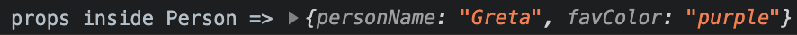

# React Props

## Learning Objectives

- Pass data to a React component with props
- Learn different methods for passing props to a React component
- Understand how props alllow us to make components dynamic

---

## Introducing Props

**Props allows us to create different versions of a component every time we render it.**

Take for example these characters from a popular online game. We could have a character component that could be used to render many characters. Each time we render a character we give it a different color.


<br>

---

The code to render the characters might look something like this.

```html
<div>
  <Character color="red" />
  <Character color="blue" />
  <Character color="green" />
  <Character color="orange" />
</div>
```

Each time we render a Character we pass it some information on _how_ to render that character.

We call this information **props**. In this case we are passing a color **prop** to the `Character` component.

**props allow us to pass information to a component when it is rendered.**

<br>

---

### Another Example

Imagine we had a set of profile cards for a social media website.


Each card would follow the same basic structure, but each would have a different color, a different image, and a different name.

In this case, we would have a `ProfileCard` component that could be used to render many profile cards.

The code would look something like this.

```html
<div>
  <ProfileCard
    color="limegreen"
    image="./images/sam-rob.jpg"
    fullName="Samual Robinson"
  />

  <ProfileCard
    color="light-blue"
    image="./images/ron-lee.jpg"
    fullName="Ron Lee"
  />

  ...

</div>
```

Upon rendering each profile card, we would pass it three pieces of information, or three **props**: the color, the image, and the name we want it to render with.

Also note that in this case the **props** are written out each on their own line. This makes the code a little easier to read when we have many **props** to pass to a component.

---

### Refresh on Functional Concepts

To understand **React props** it will help to refresh our understanding on some important concepts of how functions work. 
These concepts, although fundamental, are important for today's lesson and we will be building on them as we continue to work with React. Set up a JavaScript file in your code editor and follow along with these concepts.

Take our function `getGreeting` which takes in a person's name as a parameter and returns a customized greeting for that person.

```js
function getGreeting(personName) {
  return `Hello ${personName}.`;
}
```

Every time we call the `getGreeting` function and pass in a new name we get a different greeting.

```js
console.log(getGreeting('Greta'));
console.log(getGreeting('Hubert'));
console.log(getGreeting('Zoey'));
```

A function takes in inputs (arguments or parameters) and returns an output (the return value). This is the concept that we will be building on.

We can pass more inputs (parameters) to our function if we want.

```js
function getGreeting(personName, dayOfWeek) {
  return `Hello ${personName}. Today is ${dayOfWeek}.`;
}

console.log(getGreeting('Greta', 'Tuesday'));
console.log(getGreeting('Greta', 'Wednesday'));
```

We can pass different arguments to our function call and get a different, customized output each time.

Most of the time we will store those inputs in a variable and pass variables to our function call like so.

```js
function getGreeting(personName, dayOfWeek) {
  return `Hello ${personName}. Today is ${dayOfWeek}.`;
}

const name = 'Hubert';
const day = 'Thursday';

console.log(getGreeting(name, day));
```

We are still able to get our greeting even when the inputs come from variables.

Take some time to create your own functions that takes their own inputs (parameters).

You could create a function `createOrder` that takes as parameters information about a person's order at a restaurant and returns a string describing their order.

You could create a function that takes in information about a person and returns a string describing that person. Be sure you are comfortable with these concepts before moving on.

...

Now here's the kicker...

React components are essentially functions that take in inputs (**props**) and return an output (the **JSX** for our component).

---

## Code Along: Introducing Props

To explore the concept of **React props** we'll return to the React App we set up for the Intro to React Lesson. In there we had created a `Person` component and a `Dog` component.

<br>

<details>
  <summary>If you haven't created a Person or Dog component yet, follow these steps.</summary>

  ---

  In your terminal, navigate into your React App, and then create a `components` directory inside of the `src` directory.
  ```bash
  mkdir ./src/components
  ```

  ### Create A Person Component

  Create a file called `Person.js` inside of the `components` directory.
  ```bash
  touch ./src/components/Person.js
  ```

  Inside of `Person.js` create your `Person` component. Export your `Person` component.
  ```js
  function Person() {
    return (
      <div>
        <h2>Name: Flynn</h2>
        <p>Favorite Color: Blue</p>
      </div>
    );
  }

  export default Person;
  ```

  ---

  ### Create a Dog Component

  Create a file called `Dog.js` inside of the `components` directory.
  ```bash
  touch ./src/components/Dog.js
  ```

  Inside of `Dog.js` create your `Dog` component. Export your `Dog` component.
  ```js
  function Dog() {
    return (
      <div>
        <h2>Name: Sparky</h2>
        <p>Favorite Activity: Chasing the ball</p>
      </div>
    );
  }

  export default Dog;
  ```

  ---
</details>

<br>

We'll start with the `Person` component that we created in `./src/components/Person.js`. By passing **props** to the `Person` component we can create a different person each time.

In the `App.js` file import the `Person` component at the top of the file. Render the `Person` component inside of the `App` component.

```js
import Person from './components/Person';
import './App.css';

function App() {
  return (
    <div className="App">
      <Person />
    </div>
  );
}

export default App;
```

Just as we can pass information to a function with arguments, we can pass information to a component with **props** when we call or render that component. We can pass a `personName` **prop** to the `Person` component using the following syntax.

```js
<Person personName="Larry">
```
Here we are passing a `personName` prop to the `Person` component and setting its value to `"Larry"`.
The name of the **prop** is provided, followed by an equals sign (`=`), followed by the value that we want to pass in for that **prop**.

Give your `Person` component a `personName` **prop** and set the value to your name. It would look something like this.

```js
import Person from './components/Person';
import './App.css';

function App() {
  return (
    <div className="App">
      <Person personName="Michael"/>
    </div>
  );
}

export default App;
```

## Receiving Props

Inside of `Person.js`, where we define the `Person` component, we can receive the **props** that were passed to it.

We first set our component up to receive **props** by passing it a **props** parameter in the function call.

```js
function Person(props) {
  return (
    <div>
      <h2>Name: Flynn</h2>
      <p>Favorite Color: Blue</p>
    </div>
  );
}

export default Person;
```

Notice the **props** parameter passed in the parentheses.

To get a sense of what this **props** parameter is let's log it out. At the top of our function before the return statement, log out **props**.

```js
function Person(props) {
  console.log('props inside Person =>', props);

  return (
    <div>
      <h2>Name: Flynn</h2>
      <p>Favorite Color: Blue</p>
    </div>
  );
}

export default Person;
```

Save the file and take a look at your browser's console. What do you see?


When we log out **props**, we see that it is an **object** with a `personName` property set to the name that we passed in.

Go back to the `App.js` file and change the value for the `personName` **prop** to something else. Pass in a different person's name instead. Then check the output from our `console.log` statement.

Try changing the name of the **prop** from `firstName` to something else. What do you see now being logged from your `console.log` statement?

---

### Passing Multiple Props

Let's try passing a second **prop** to the `Person` component. Pass in a `favColor` props and give it any value you want. It would look something like this.

In App.js
```js
import Person from './components/Person';
import './App.css';

function App() {
  return (
    <div className="App">
      <Person personName="Greta" favColor="purple" />
    </div>
  );
}

export default App;
```
If you are still logging out **props** in your `Person`, take a look at what is being logged out in the browser's console. 

We are logging out an **object**, this time with two properties. 
In Person.js, `props` inside the `Person` function is is an **object** with a `personName` property and now a `favColor` property.



From the `App` Component, we can pass any **prop** we want to the `Person` component and it will show up as a property in the props **object**.

### Activity:

From the `App` component, try passing more props to the `Person` component and see what gets logged out.

Try Passing
- a hometown **prop**
- a favorite food **prop**
- an occupation **prop**

<details>
  <summary>Example:</summary>

  ```js
  function App() {
    return (
      <div className="App">
        <Person
          personName="Greta"
          favColor="purple"
          hometown="Chicago, IL"
          favoriteFood="pizza" 
          occupation="marine biologist"
        />
      </div>
    );
  }
  ```

  In this example, we've opted to put each prop on it's own line, to aid readability. If we had tried to fit all **props** together on the same line, the component would be rather long and cause our code to trail off the page or wrap.

  ---

  Note that we are still logging out **props** in the `Person` component.

  ```js
  function Person(props) {
    console.log('props inside Person =>', props);

    return (
      <div>
        <h2>Name: {props.personName}</h2>
        <p>Favorite Color: {props.favColor}</p>
      </div>
    );
  }
  ```
</details>

## Passing Different Data Types as Props

So far we've just been passing string values as props, such as `"Greta"` or `"purple"`. But we can also pass other data types as **props** as well. Let's try passing a number as a **prop** to our `Person` component.

Pass a `favNum` prop to the `Person` component. Notice that this time the value is wrapped in curly braces (`{}`) instead of quotes (`""`).

```js
import Person from './components/Person';
import './App.css';

function App() {
  return (
    <div className="App">
      <Person personName="Greta" favColor="purple" favNum={5} />
    </div>
  );
}

export default App;
```

Now check your developer console. If you are still logging `props` in your `Person` component you should see the **props** object now has a `favNum` property set the number you passed in.

_Anytime we pass a **prop** that is not a string, we'll wrap the value in curly braces (`{}`)._

Experiment with passing other data types as well. Try passing a boolean or null as a **prop** to the `Person` component.

## Passing an Array as Props

// TODO: write example for array as props

## Passing an Object as Props

// TODO: write example for objects as props

---

### Using a Component's Props

At this point we are passing **props** to a component. Now let's see how we can use those **props** to render something to the page.

Since `props` is just a JavaScript object we can reference the properties in that object using dot notation. Let's insert the `personName` **prop** and the `favColor` **prop** into our **JSX**.

```js
function Person(props) {
  console.log('props inside Person =>', props);

  return (
    <div>
      <h2>Name: {props.personName}</h2>
      <p>Favorite Color: {props.favColor}</p>
    </div>
  );
}

export default Person;
```

In order to insert JavaScript into **JSX** we use curly braces, `{}`. Inside a pair of curly braces we can insert any JavaScript we want. In this case, we are just inserting two properties from our **props** object that is coming in as the **props** parameter to the function.

Take a look at the browser. We are rendering the `Person` component to the page with the values we passed to the component as **props**.

---

### Rendering Different Instances of a Component

At this point we are set up to create many different people using our `Person` component. Let's render out a few more `Person` components passing different props each time.

```js
import Person from './components/Person';
import './App.css';

function App() {
  return (
    <div className="App">
      <Person personName="Greta" favColor="purple" />
      <Person personName="Hubert" favColor="lime green" />
      <Person personName="Roberta" favColor="orange" />
    </div>
  );
}

export default App;
```

Take a look at the output in the browser. We now have three different `Person` components rendered to the page. Each one has a different output based on the **props** that we've passed to it when rendering that `Person` component in the `App` component.
