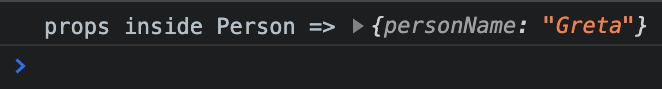

# React Props

## Learning Objectives

- Pass data to a React component with props
- Learn different methods for passing props to a React component
- Understand how props alllow us to make components dynamic

---

## Introducing Props

Props are a tool for passing information from a parent component to a child component. They allows us to create different versions of the component every time we render it out.

---

### Refresh on Functional Concepts

To understand **React props** it will help to refresh our understanding on some important concepts of how functions work. 
These concepts may seem basic to some at this point but they are very important for today's lesson and we will be building on them. Follow along and play around with these concepts in a code editor.

Take our function `getGreeting` which takes in a person's name as a parameter and returns customized greeting for that person.

```js
function getGreeting(personName) {
  return `Hello ${personName}.`;
}
```

Every time we call the `getGreeting` function and pass in a new name we get a different greeting.

```js
console.log(getGreeting('Greta'));
console.log(getGreeting('Hubert'));
console.log(getGreeting('Zoey'));
```

We can pass more parameters to our function if we want.

```js
function getGreeting(personName, dayOfWeek) {
  return `Hello ${personName}. Today is ${dayOfWeek}.`;
}

console.log(getGreeting('Greta', 'Tuesday'));
console.log(getGreeting('Greta', 'Wednesday'));
```

We can pass different arguments to our function call and get a different, customized output each time.

We can even store the inputs in a variable and pass variables to our function call instead like so.

```js
function getGreeting(personName, dayOfWeek) {
  return `Hello ${personName}. Today is ${dayOfWeek}.`;
}

const name = 'Hubert';
const day = 'Thursday';

console.log(getGreeting(name, day));
```

We are still able to get our greeting even when the inputs come from variables.

Create your own function that takes it's own parameters. For example, you could create a function `createOrder` that takes as parameters information about a person's order at a restaurant and returns a string describing their order. You should be very comfortable with these concepts before moving on.

---

## Code Along: Introducing Props

To explore the concept of **React props** let's return to the Recipe App that we started in the "Intro to React" lesson. We'll start with the `Person` component that we created in `./src/components/Person.js`. Let's see how we can set up our `Person` component to create a different person each time.

In the `App.js` file import the `Person` component again. And let's render the `Person` component inside of the `App` component. For now, comment out the other components in our `App` component.

```js
import Header from './components/Header';
import HomePage from './pages/HomePage';
import MainPage from './pages/MainPage';
import Person from './components/Person';
import './App.css';

function App() {
  return (
    <div className="App">
      <Person />
      {/* <Header /> */}
      {/* <HomePage /> */}
      {/* <MainPage /> */}
    </div>
  );
}

export default App;
```

Just as we can pass information to a function with arguments when we call it, we can pass information to a component with **props** when we call or render that component. Pass a personName **prop** to the `Person` component like so.

```js
// import Header from './components/Header';
// import HomePage from './pages/HomePage';
// import MainPage from './pages/MainPage';
import Person from './components/Person';
import './App.css';

function App() {
  return (
    <div className="App">
      <Person personName="Greta"/>
      {/* <Header /> */}
      {/* <HomePage /> */}
      {/* <MainPage /> */}
    </div>
  );
}

export default App;
```

Inside of `Person.js` where we define the `Person` component we can set up our component to recieve **props** by passing a parameter to the `Person` function like so.

```js
function Person(props) {
  return (
    <div>
      <h2>Name: Flynn</h2>
      <p>Favorite Color: Blue</p>
    </div>
  );
}

export default Person;
```

At the top of our function before the return statement, let's log out **props**.

```js
function Person(props) {
  console.log('props inside Person =>', props);

  return (
    <div>
      <h2>Name: Flynn</h2>
      <p>Favorite Color: Blue</p>
    </div>
  );
}

export default Person;
```

Save the file and take a look at your browser's console. What do you see?



When we log out **props**, we see that props is an **object** with a personName property set to "Greta" or whatever value we passed in.

Go back to the `App.js` file and change the personName prop to something else. Pass in a different string instead of "Greta". Try passing in a number or a boolean. What do you see in the console?

---

### Passing Multiple Props

Pass a second **prop** to the `Person` component. Let's pass a `favColor` props and give it any value you want.

```js
// import Header from './components/Header';
// import HomePage from './pages/HomePage';
// import MainPage from './pages/MainPage';
import Person from './components/Person';
import './App.css';

function App() {
  return (
    <div className="App">
      <Person personName="Greta" favColor="purple" />
      {/* <Header /> */}
      {/* <HomePage /> */}
      {/* <MainPage /> */}
    </div>
  );
}

export default App;
```
If you are still logging out **props** in your `Person`, take a look at what is being logged out in the browser's console. 

We are still logging out an **object**. **Props** inside the `Person` component is an **object** with a `personName` property and a `favColor` property.

We can pass any **prop** we want to the `Person` component and it will show up as a property in the props **object**. Try passing more props to the `Person` component and see what gets logged out.

---

### Using a Component's Props

At this point we are passing **props** to a component. Now let's see how we can use those **props** to render something to the page.

Since `props` is just a JavaScript object we can reference the properties in that object using dot notation. Let's insert the `personName` **prop** and the `favColor` **prop** into our **JSX**.

```js
function Person(props) {
  console.log('props inside Person =>', props);

  return (
    <div>
      <h2>Name: {props.personName}</h2>
      <p>Favorite Color: {props.favColor}</p>
    </div>
  );
}

export default Person;
```

In order to insert JavaScript into **JSX** we use curly braces, `{}`. Inside a pair of curly braces we can insert any JavaScript we want. In this case, we are just inserting two properties from our **props** object that is coming in as the **props** parameter to the function.

Take a look at the browser. We are rendering the `Person` component to the page with the values we passed to the component as **props**.

---

### Rendering Different Instances of a Component

At this point we are set up to create many different people using our `Person` component. Let's render out a few more `Person` components passing different props each time.

```js
// import Header from './components/Header';
// import HomePage from './pages/HomePage';
// import MainPage from './pages/MainPage';
import Person from './components/Person';
import './App.css';

function App() {
  return (
    <div className="App">
      <Person personName="Greta" favColor="purple" />
      <Person personName="Hubert" favColor="lime green" />
      <Person personName="Roberta" favColor="orange" />
      {/* <Header /> */}
      {/* <HomePage /> */}
      {/* <MainPage /> */}
    </div>
  );
}

export default App;
```

Take a look at the output in the browser. We now have three different `Person` components rendered to the page. Each one has a different output based on the **props** that we've passed to it when rendering that `Person` component in the `App` component.

## Code Along: Adding Props to the Recipe App

In our `App` component in `./src/App.js`, let's remove our `Person` components and bring back the `Header`, `HomePage`, and `MainPage` components. You can also comment out the `Person` components if you want to save them for later.

```js

```

<br>
<br>
<br>
<br>
<br>
<br>
<br>
<br>
<br>
<br>
<br>
<br>
<br>
<br>

## Points to Remember

- Props cannot be changed or reassigned; they are immutable.
- We use React state to handle data that changes over time.